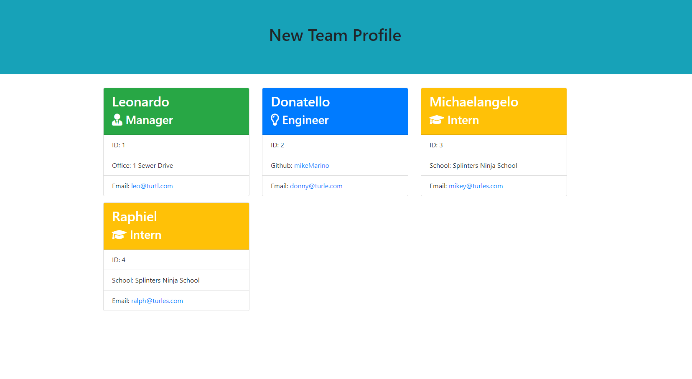
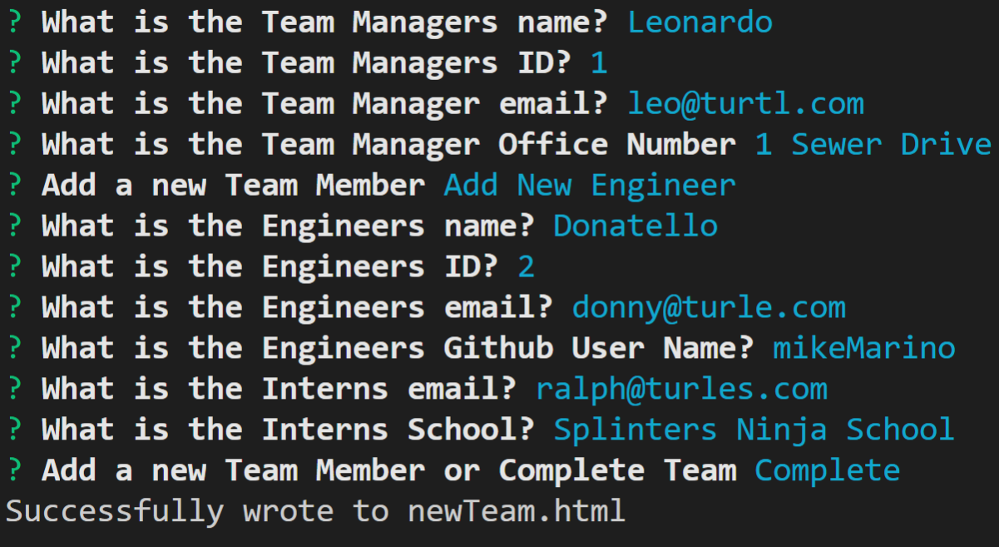

# Homework 10 - Team Profile Generator

## Table of Contents 
- [Description](#description) 
- [Installation](#installation) 
- [Usage](#usage)
- [Testing](#testing)
- [Contribute](#contribute)
- [Credits](#credits) 
- [License](#license) 
- [Questions](#questions) 

## Description

TEAM PROFILE GENERATOR

This project may have some requeriments you need to meet in order to compile it. 
You may need NodeJS in order to run javascript on the console and install dependecnies. You can go to the NodeJS site and follow trough the installation process.  After you get the node command on the console, you will have the node package manager npm as well. Please read the package instruction section below.

## Installation:
These instructions will get you a copy of the project up and running on your local machine for development and testing purposes. 

In this homework assignment, your challenge is to build a Node CLI that takes in information about employees and generates an HTML webpage that displays summaries for each person. Since testing is a key piece in making code maintainable, you will also be ensuring that all unit tests pass. The application will prompt the user for information about the team manager and then information about the team members. The user can input any number of team members, and they may be a mix of engineers and interns. This assignment must also pass all unit tests. When the user has completed building the team, the application will create an HTML file that displays a nicely formatted team roster based on the information provided by the user.

## Usage:
This is a command line application that uses an interface to prompt the user to enter information about a team.  The result is an HTML file that displays a nicely formatted team roster, based on the user input.

In order to start using the project you need to clone it to your computer. Or you can download the the zip version.
After you have it on you pc, you need to go in the console to the project folder and execute the following command to gather all the dependencies.

> npm install

## Testing:
Uses the Jest package for a suite of unit tests.  Tests are conducted on all class objects to ensure their functionality is working correctly.

## Contributing: 
owner of repo

To contribute to < strong > Big Bad Readme generator < /strong>, follow these steps:

Create a branch:
>git checkout - b <branch_name>

Make your changes and commit them:
>git commit - m '<commit_message>'

Push to the original branch:
>git push origin <project_name>/<location>

Create the pull request. Alternatively see the GitHub documentation on creating a pull request.

## Credits:
The owner of repo and the excellent teachers at the uPenn LPS Full Stack Web Development Coding Bootcamp.
## License:
This project uses the following license: 

https://opensource.org/licenses/MIT

<strong>
Copyright 2020 mikeMarino
</strong>

Permission is hereby granted, free of charge, to any person obtaining a copy of this software and     associated documentation files (the "Software"), to deal in the Software without restriction, including without limitation the rights to use, copy, modify, merge, publish, distribute, sublicense, and/or sell copies of the Software, and to permit persons to whom the Software is furnished to do so, subject to the following conditions:

The above copyright notice and this permission notice shall be included in all copies or substantial portions of the Software.

THE SOFTWARE IS PROVIDED "AS IS", WITHOUT WARRANTY OF ANY KIND, EXPRESS OR IMPLIED, INCLUDING BUT NOT LIMITED TO THE WARRANTIES OF MERCHANTABILITY, FITNESS FOR A PARTICULAR PURPOSE AND NONINFRINGEMENT. IN NO EVENT SHALL THE AUTHORS OR COPYRIGHT HOLDERS BE LIABLE FOR ANY CLAIM, DAMAGES OR OTHER LIABILITY, WHETHER IN AN ACTION OF CONTRACT, TORT OR OTHERWISE, ARISING FROM, OUT OF OR IN CONNECTION WITH THE SOFTWARE OR THE USE OR OTHER DEALINGS IN THE SOFTWARE.

## Questions:
For all questions about this project, please email marino1820@gmail.com

Copyright(c) 2021 mikeMarino